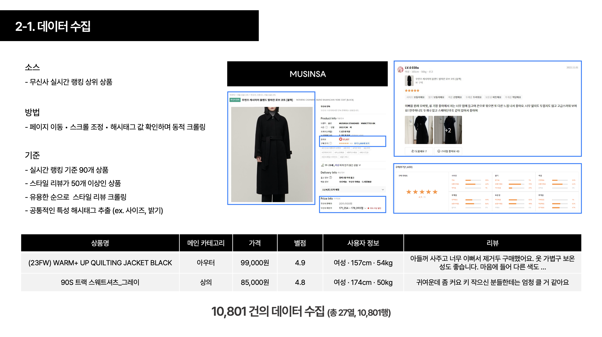
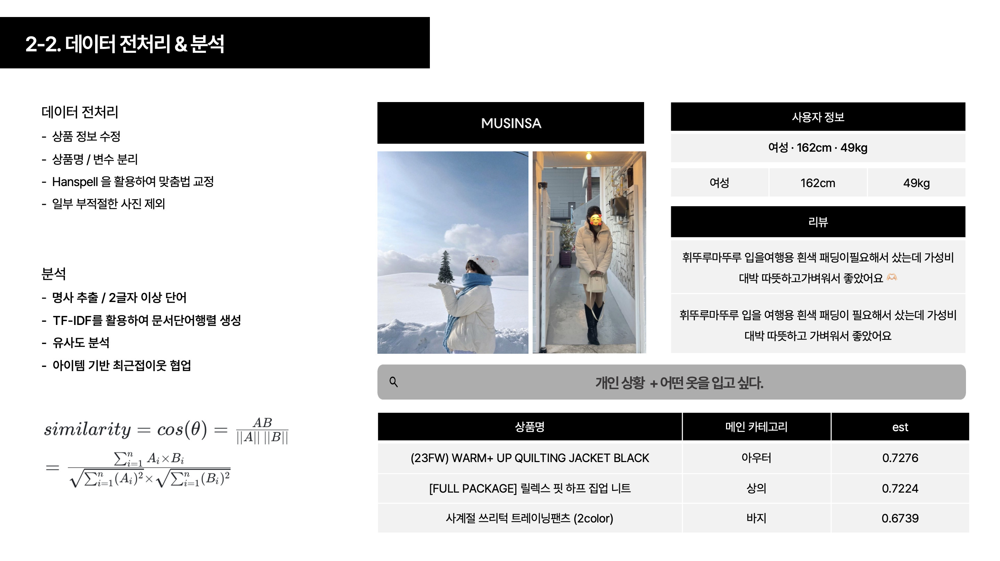
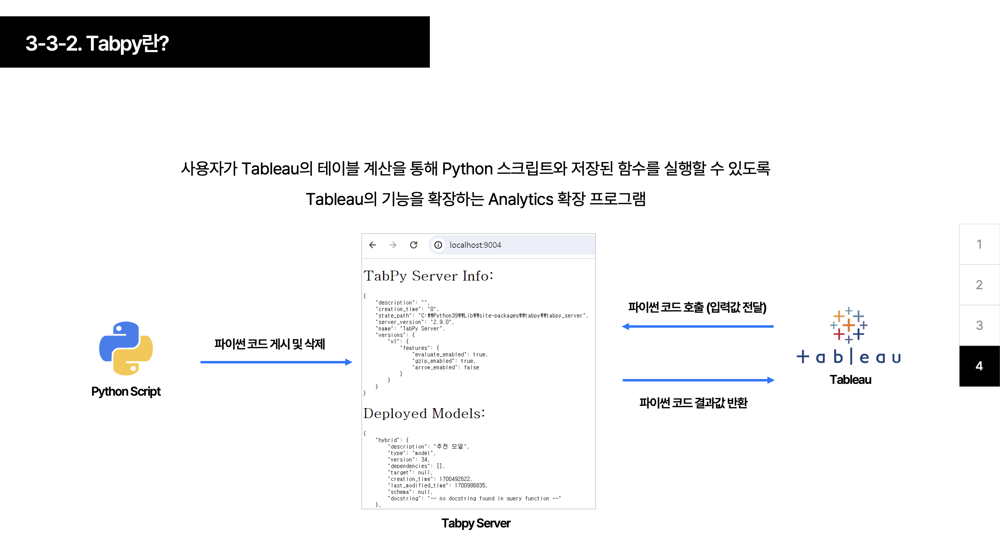
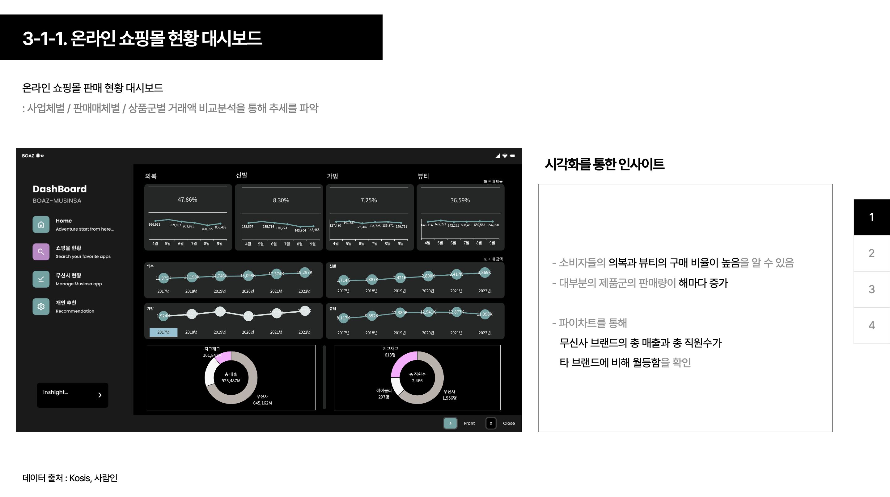
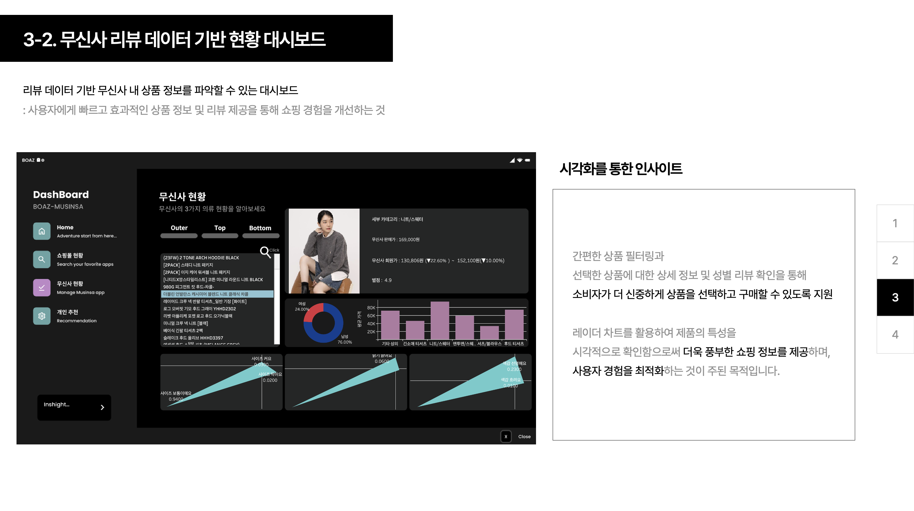
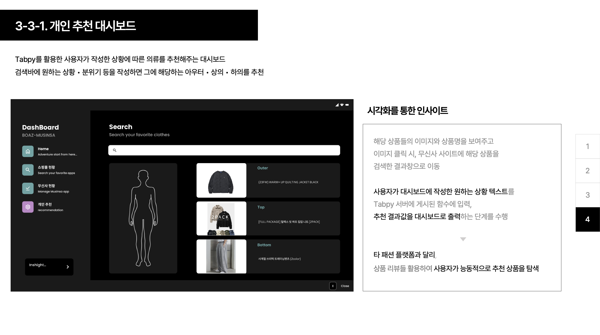

# 무신사 브랜드 스타일링 추천 시스템 프로젝트
사용자 행동 데이터를 기반으로 한 무신사 브랜드 스타일링 맞춤 추천 시스템 개발 프로젝트입니다.

## 프로젝트 개요
- **주제 :** 사용자 행동 데이터를 기반으로 한 무신사 브랜드 스타일링 추천 시스템 구축  
- **기간 :** 2023.08 ~ 2024.01
  - 주제 선정 및 아이디어 기획 : 2개월
  - 데이터 크롤링, 전처리, EDA 및 모델링 : 2개월
  - 대시보드 설계 및 제작 : 2개월
- **팀 구성 :** 4인
- **역할 :** 아이디어 기획, 데이터 수집 및 전처리, 사용자 행동 패턴 도출, 대시보드 설계
- **사용 언어 및 툴 :** Python, Tableau, Tabpy
- **주요 기법 :** tf-idf, 다양한 유사도 계산 모델 실험

## 프로젝트 배경
- 패션 플랫폼 사용자들의 불만족 사항과 니즈를 파악하기 위해 소비자 설문 조사 진행
- 구매자 관련 데이터를 활용하여 보다 효율적인 쇼핑 경험 제공
- 상품 리뷰 데이터를 분석해 소비자가 능동적으로 추천 상품 탐색 가능하도록 지원
- Tabpy를 활용해 Python 스크립트의 결과를 Tableau 대시보드에 출력하여 단순 필터링이 아닌 분석적인 결과 제공
무신사에서 제공하는 상품 정보와 리뷰 데이터를 기반으로 개인 맞춤형 의류 추천 시스템을 개발했습니다.

- **데이터 수집 :** BeautifulSoup을 이용한 웹 크롤링으로 10,801건의 상품 정보 및 리뷰 수집
- **데이터 전처리 :** 맞춤법 교정, 불용어 처리, 명사 추출
- **추천 시스템 :** TF-IDF와 코사인 유사도를 활용한 유사도 기반 추천
- **대시보드 :** Tableau와 Tabpy를 연동해 실시간 추천 결과 제공

## 데이터 전처리 및 분석
1. 데이터 수집 및 전처리
  - 사용자 행동 데이터를 기반으로 결측치 처리 및 이상치 제거
  - 불만족 요인과 구매 패턴 분석을 위한 데이터 정규화 및 원핫 인코딩 적용
2. 특징 추출
  - TF-IDF를 활용해 리뷰와 설명 텍스트의 중요 단어 추출
  - K-means를 이용해 유사한 행동 패턴을 가진 사용자 군집화
3. 추천 알고리즘
  - Cosine Similarity를 활용한 유사도 기반 추천 시스템 설계
  - 협업 필터링으로 개인 맞춤형 추천 리스트 제공

  
  

## 사용한 기법
1. 유사도 기반 추천 시스템
- TF-IDF + 코사인 유사도
  - TF-IDF를 통해 각 리뷰를 벡터화
  - 코사인 유사도로 유사 상품 추천
- 추천 범위 : 상위 1000개의 유사 상품 중 카테고리별 1개씩 추천
2. 협업 필터링
- 아이템 기반 최근접 이웃 방식
  - 비슷한 아이템끼리 추천
  - 유사도 계산 방식 : 코사인 유사도
 
## 대시보드 설계
- 사용 툴 : Tableau + Tabpy

- 기능
  - 카테고리 필터링 : 아우터, 상의, 하의 등
  - 추천 결과 시각화 : 상품 이미지 및 리뷰 평점 표시
  - 추천 로직 : 사용자가 작성한 텍스트를 기반으로 실시간 추천 결과 제공
- 특징
  - 레이더 차트 : 상품 특성 (사이즈, 밝기, 색감) 비교
  - 파이 차트 : 플랫폼별 매출 현황 비교

 
## 인사이트
- 사용자 불만족 요인 : 특정 상품군에 대한 리뷰 분석을 통해 사용자 불만족 요인 파악
- 구매 패턴 분석 : 데이터 분석 결과, 유사한 구매 패턴을 가진 사용자들 간의 추천 효과가 높음
- 효과적인 쇼핑 지원 : 상품 리뷰와 구매 데이터를 결합한 추천으로 소비자의 만족도 향상

## 기대 효과
- 개인화된 추천 : 사용자의 행동 데이터를 기반으로 한 정교한 추천 제공
- 만족도 향상 : 불만족 요인을 해결한 맞춤형 상품 추천으로 서비스 만족도 상승
- 판매 증가 : 맞춤형 추천을 통한 구매 전환율 향상

## 한계 및 개선 방안
- 계절성 데이터의 한계 : 수집한 데이터가 특정 계절에 치우쳐 있어 타 계절 추천의 미흡
  - 개선 방안 : 다양한 계절 데이터를 추가 수집하여 보완
- 데이터의 다양성 부족 : 텍스트 위주의 데이터 분석으로 이미지 정보 활용의 부족
  - 개선 방안 : 이미지 분석을 위한 CNN 등 딥러닝 기법 활용 검토
- 정교한 추천 모델의 부재 : 리뷰 + 이미지 모두 활용한 추천 시스템의 부재
  - 개선 방안 : 이미지 특징 추출과 텍스트 데이터를 결합한 멀티모달 추천 시스템 구축
 
## 느낀점
이번 프로젝트를 통해 패션 플랫폼에서 개인 맞춤형 추천 시스템의 필요성과 그 가능성에 대해 깊이 있게 고민할 수 있었습니다. 특히, 사용자 행동 데이터를 활용한 추천 알고리즘 설계와 Tabpy를 이용한 대시보드 시각화 과정에서 많은 인사이트를 얻었습니다.

다음과 같은 기능을 더 도입한다면 보다 정교한 추천 시스템을 구축할 수 있을 것으로 기대됩니다.

1. 이미지 분석 도입
CNN(Convolutional Neural Network)을 활용해 상품 이미지의 특징을 추출하고, 이를 기반으로 유사 상품 추천 시스템을 보완할 수 있습니다.
ex) 텍스트 기반 추천의 한계를 보완해, 상품의 시각적 특징을 반영한 추천 가능
2. 멀티모달 추천 시스템
텍스트와 이미지 데이터를 결합한 멀티모달 추천 알고리즘 개발을 통해 정밀도를 높일 수 있습니다.
ex) 상품 설명과 리뷰 텍스트 + 상품 이미지를 함께 활용한 추천
3. 실시간 추천
사용자의 실시간 행동 데이터를 반영한 추천 시스템을 구축해 사용자 경험(UX)을 향상시킬 수 있습니다.
ex) 사용자가 조회한 상품, 클릭 패턴, 구매 이력 등을 실시간으로 반영해 동적 추천 제공

이와 같은 확장 방향을 통해 더욱 개인화된 맞춤형 추천 시스템을 설계하고, 사용자 만족도와 구매 전환율을 더욱 높일 수 있을 것으로 기대합니다. 앞으로 추가적인 데이터를 확보하고, 다양한 추천 기법을 실험해 나가며 더욱 발전된 시스템을 만들어 나가고 싶습니다.
